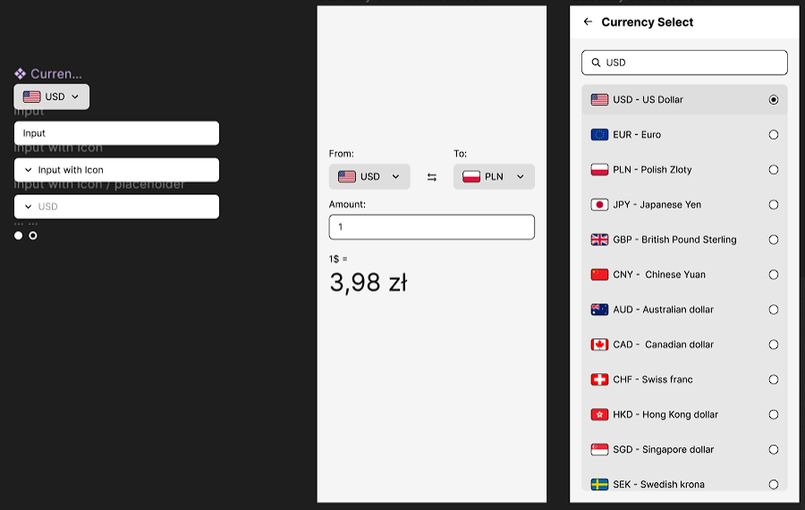

##### Requirements:
1. User Interface:
* Replicate the provided mockups as closely as possible.
* Implement a currency selection screen with a searchable list displaying currency codes and
names. Highlight the selected currency visually as represented in the design.
* Create a conversion screen with a field for entering the amount and buttons for selecting
currencies.
2. Functionality:
* Integrate the openexchangerates.org API to fetch the latest currency exchange rates.
* Ensure the currency conversion calculation is accurate and updates as the user types.
* Store the latest fetched exchange rates locally and allow the app to work offline with the last
known rates.
* Implement a swap function to quickly invert the 'From' and 'To' currencies.
* Show only available currencies from the API in the currency selection list
3. Code Quality:
* Write clean, readable, and maintainable code.
* Ensure the app is properly typed with TypeScript.
* Handle API errors gracefully and display user-friendly error messages.
4. Performance:
* Optimize the app for performance, especially the currency selection list.

##### Deliverables:
1. Source code pushed to a Git repository (e.g., GitHub, GitLab).
2. Documentation on how to run the application locally.
3. A brief explanation of the app architecture and any third-party libraries used.

##### Evaluation Criteria:

* Adherence to the design mockups and requirements.
* Code quality, including readability and adherence to TypeScript best practices.
* App performance and handling of edge cases.
* Completeness of the implemented features.
* Any additional features or touches that improve the app's usability or user experience.

### Getting Started

### Step 1: clone and install

```
git clone https://github.com/GemsGame/react-native-currency-converter.git
```
```
cd react-native-currency-converter
```
```
npm install
```
### Step 2: Start the App
Let Metro Bundler run in its own terminal. Open a new terminal from the root of your React Native project. Run the following command to start your Android or iOS app:

```
npm run android
```
```
npm run ios
```

If everything is set up correctly, you should see your new app running in your Android Emulator or iOS Simulator shortly provided you have set up your emulator/simulator correctly.

This is one way to run your app — you can also run it directly from within Android Studio and Xcode respectively.


### Explanation about arhitecture

